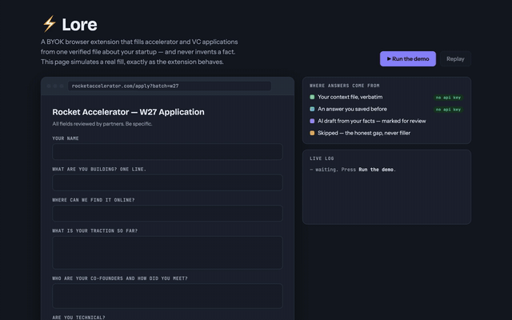
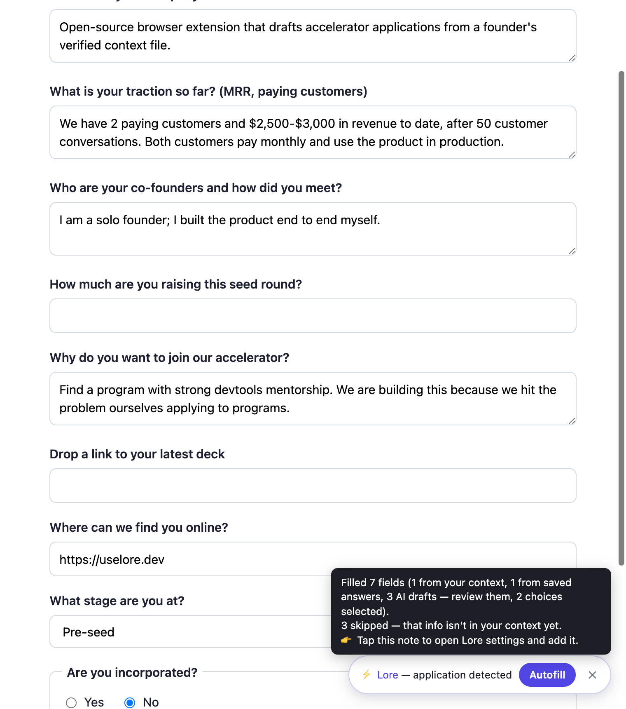
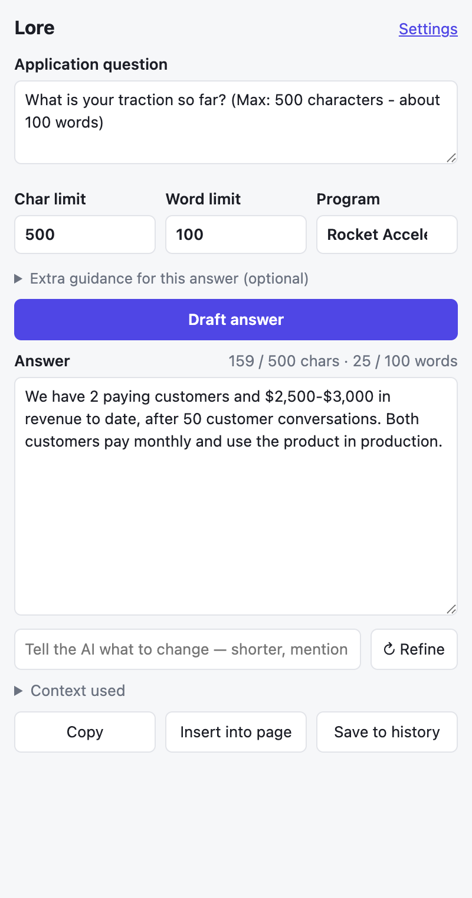
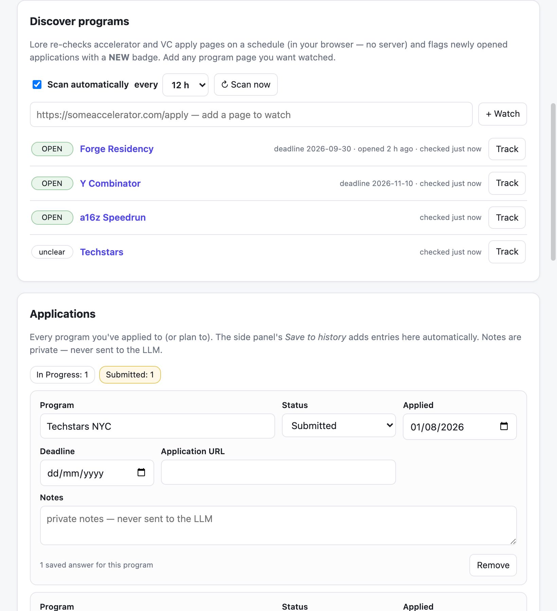

# Lore — Founder Context Autofill

Open-source, BYOK Chrome extension that fills accelerator / VC / grant applications
from **one portable file of verified facts about your startup**. No server, no
subscription: your context and your API key live in your browser; calls go straight
to the LLM provider you choose — or to no provider at all for everything that
doesn't need one.

> **Your context is the product. The LLM is interchangeable.**



| Autofill on a real form | Side panel: draft · limits · refine |
|---|---|
|  |  |




## Core guarantees

1. **Facts are never invented.** Numbers, names, URLs come from your context file
   or don't appear at all. Every number in an AI draft is verified *in code*
   against the context that produced it; anything unmatched is flagged.
2. **Gaps are honest.** Unknown answers become `[MISSING: …]` flags or empty
   fields — never plausible filler.
3. **Works without an API key.** Identity fields, previously saved answers, and
   option matching run entirely locally. A key only adds AI-drafted prose for
   novel questions.

## What it does

### Detection
Recognizes funding-application pages via layered local heuristics (no LLM, no
network): a real form + startup-application vocabulary across independent
categories (traction / team / fundraising / program / product) − negative signals
(job-application, checkout). Sees **through iframes** — Airtable / Typeform /
Tally / Google-Forms embeds — attributing the program to the embedding site.
Detected pages get an `APP` toolbar badge, an in-page pill, and a side-panel banner.

### Autofill (the pill, or ⚡ Autofill page in the panel)
Three phases, each reported in a summary toast:

1. **Local (keyless):** identity fields (company name, website, deck, LinkedIn,
   Twitter, GitHub, email, founder name, location, stage, industry, raise amount…)
   filled straight from context; questions answered before (any program) reused
   from history.
2. **AI field-mapping (one batched call):** the model maps remaining field labels
   to context paths — *it only points; values are resolved from your context in
   code*. Then prose fields are drafted individually through the retrieval
   pipeline below. Email/URL/short inputs never receive prose.
3. **Multiple choice:** selects, radio/checkbox groups, ARIA widgets. Options are
   matched against context values in code; semantic picks (context "Not yet
   incorporated" → option "No") go to the model, which returns an option *number*.
   Yes/no questions are never string-matched (only the model may decide them),
   and undeterminable questions ("How did you hear about us?") are left blank.

A per-field **✨ Fill** button appears when you focus any empty field.

### Drafting pipeline (side panel)
Two-call retrieval: call 1 sends only the context's *field names* to pick relevant
sections; call 2 sends those sections + the question. Output is fact-checked in
code, `[MISSING]` flags surface as a checklist, and character limits are enforced
by counting (one automatic shorten-retry).

### Learning loop
- **Save to history** stores each Q&A (per program) — future similar questions
  autofill keyless, in your own voice.
- **Hand-written answers**: fill a field Lore couldn't, and a toast offers to save
  it — next application, it autofills.
- **Pitch-deck ingest**: upload a PDF in settings; your model proposes values for
  empty fields only, all marked *unverified* for review.

### Program discovery (aggregator)
Re-scans a registry of accelerator/VC apply pages (plus any URL you add) on a
`chrome.alarms` schedule — 6/12/24 h, entirely in your browser, no server.
Detects "applications open" + parses deadlines from page text; a program that
flips to open sets a green **NEW** toolbar badge. Each row has **Track** →
one click into the application tracker with its deadline and URL. JS-only
pages that serve empty HTML honestly report "unclear" instead of guessing.

### Application tracker
Every program you apply to, with status (planning → … → accepted/rejected),
dates, URL, private notes (never sent to any LLM), and per-program answer counts.
Auto-tracks on save; **auto-logs "submitted"** when it sees a success page after a
detected application (badge flips to ✓); manual *Track it* / *Mark submitted*
in the panel.

## Architecture

```
manifest.json          MV3; SW named worker.js (renamed once to bust a Chrome SW-cache bug)
worker.js              service worker: providers orchestration, retrieval, fact-check,
                       identity rules, AI field/choice mapping, tracker, detection state
content.js             page side: detection heuristics, pill/✨/toast UI (shadow DOM),
                       label extraction, autofill phases, manual-answer capture, insert
sidepanel.html/js/css  question → draft → warnings → copy/insert/save; page banner
options.html/js/css    provider+key+model (fetched model dropdown), paginated context
                       wizard, deck upload, application tracker, import/export JSON
lib/providers.js       adapters: Anthropic, OpenAI, Gemini, OpenRouter, custom
                       OpenAI-compatible base URL; complete/listModels/interpret(PDF)
lib/retrieval.js       path listing, hydration, history similarity
lib/factcheck.js       numeric-claim verification, [MISSING] extraction
lib/context-template.js  founder_context schema; facts as {value, verified, updated}
```

- Plain JS, no build step. Safari-compatible (sidePanel feature-detected → popup;
  package with `xcrun safari-web-extension-converter`, needs Xcode).
- Context lives in `chrome.storage.local`; export/import as `founder_context.json`
  (git-friendly, portable).
- Keys are per-provider in local storage — anyone with the browser profile can
  read them.

## Getting started

**Requirements:** a Chromium browser (Chrome, Brave, Edge, Arc). No build step,
no Node — the extension is plain JS. Optional: an LLM API key for AI drafting
(everything else works without one).

### 1 · Install the extension

```bash
git clone https://github.com/DeepakSingh260/founder-lore.git
```

1. Open `chrome://extensions`
2. Toggle **Developer mode** (top right)
3. Click **Load unpacked** → select the cloned `founder-lore` folder
4. Pin **Lore** to the toolbar (puzzle-piece icon → 📌)

### 2 · Connect a model (optional but recommended)

Right-click the Lore icon → **Options**:

1. Pick a provider — Anthropic, OpenAI, Gemini, OpenRouter, or any
   OpenAI-compatible base URL (Ollama, LM Studio, vLLM…)
2. Paste your API key — the model dropdown fills itself from your provider
3. **Save provider settings**

Your key stays in this browser profile and is sent only to the provider you
picked. Skip this step entirely and Lore still does identity fills, saved-answer
reuse, option matching, detection, and tracking — only novel prose drafting
needs the key.

### 3 · Build your founder context

Still in Options, under **Founder context** — this file *is* the product:

- Walk the step-by-step wizard (Company → Founders → Traction → …). Numbers have
  a **✓ verified** toggle: tick it and no model may ever alter that value.
- Or **📄 Upload pitch deck…** — your model proposes values for empty fields,
  all marked unverified for your review.
- Or **Import JSON** if you already have a `founder_context.json`.
- **Export JSON** any time — the file is portable; keep it in a private repo.

### 4 · Fill an application

1. Open any accelerator/VC/grant application — Lore detects it (toolbar shows
   **APP**, a pill appears on the page; works inside Airtable/Typeform/Google
   Forms embeds)
2. Hit **Autofill** on the pill — or focus any field and click **✨ Fill**
3. Review: every answer is source-tagged (context / saved answer / AI draft);
   unknown answers are *skipped*, never invented
4. For long-form questions, open the side panel (click the Lore icon): draft,
   set char/word limits (auto-detected from the question), add per-answer
   guidance, **↻ Refine**, then **Insert into page** and **Save to history** —
   saved answers autofill on every future application
5. When you submit, Lore logs it in the **Applications** tracker automatically

### Try it with no API key at all

`dev/` ships a mock provider and a test application form:

```bash
python3 dev/mock_llm.py &                      # OpenAI-compatible mock on :8998
python3 -m http.server 8787 --directory dev &  # serves the test form
```

Options → provider **Custom (OpenAI-compatible)** → base URL
`http://localhost:8998/v1` → any string as the key → model `mock-claude-demo`.
Then open `http://localhost:8787/test-form.html` and hit Autofill — the full
pipeline runs (retrieval, mapping, fact-check, choices) with canned prose.

### Safari

The code is Safari-ready (the side panel falls back to a toolbar popup).
Package it with Xcode:

```bash
xcrun safari-web-extension-converter /path/to/founder-lore --app-name Lore --macos-only
```

Run the generated app once, then Safari → Settings → Extensions → enable Lore
(Develop menu → *Allow Unsigned Extensions* for local builds).

## Honest limits

- Selective retrieval limits what each request exposes, but the provider still
  sees what's sent — this is not end-to-end privacy.
- Searchable comboboxes (Airtable type-to-filter) and file uploads can't be
  auto-filled.
- Detection is heuristic; an undetected page still works via the side panel.
- AI drafts are marked "review them" for a reason.
